# Music Play
#### "When words fail, the music speaks"  

## About MusicPlay

MusicPlay is a free application designed to empower children to learn music notes independently, without the need for a private tutor. The app leverages pre-built learning modules for identifying notes from images and autocorrelation algorithms to recognize piano playing.

## The Model

### Dataset
    
For model training, we utilized a massive dataset of images containing music staff lines, which were prepared in advance and captured in good quality, including both camera-quality images and distorted ones. The dataset is referred to as "Printed Images of Music Staves" or simply PrIMuS.

We built the model ourselves, and its training took over 100 hours.

### Model Architecture

In creating the model, we based our approach on existing configurations of Optical Character Recognition (OCR) models, which we modified and tailored to our needs.

The architecture of the model is structured as follows:
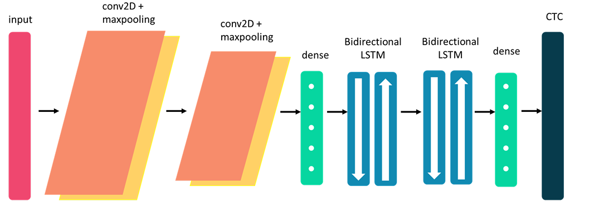

### Model Type

The most critical layers enabling the success of our model are the bidirectional hidden layers.

A bidirectional layer functions like two LSTM layers, once taking input data forward (forward propagation) and once taking it backward (backward propagation).

These layers assist the model in understanding what information precedes and follows to provide more context for each pixel. Instead of examining a single pixel at a time, the model evaluates the pixel along with its surroundings.

In this manner, if we were to analyze a sentence, we would know the words before and after a certain word, providing it context. For example:
"חבל" -> rope
But in the context "חבל על הזמן" -> cool

Each bidirectional layer provides the model with depth and the ability to understand more complex features.

This allows connecting the rhythm and key of occurrences initially equal to notes it identifies later, and a relation of the position of each note on the staves.

CTC Layer

A specialized layer for computing the Loss function, meaning how accurately the model predicts or fails at each learning cycle.

As it takes and learns a complete row of characters at once rather than each character individually, it was necessary to assess how well it guesses the entire row together rather than each character separately, as most Loss functions do.

Since this layer is a custom layer that we implemented for our needs and fits within the Hidden Layers of the model's neural network, the technological constraints of our time did not allow us to use only the client-side, so we have a FLASK server.

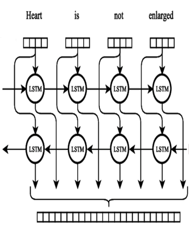

### Training Method - Stratified Sampling

The method is based on taking partial samples from groups with a common denominator for training.

The use of this method in machine learning is primarily for working with massive datasets.

In our model, we divided the files according to the lengths of the labels and then took samples equally.

Thanks to this method, we were able to save time in training the model while still achieving good results.
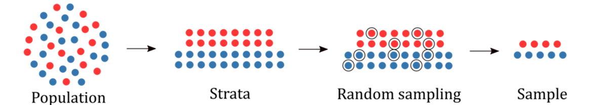

### Model Results

The model achieved an accuracy of 96%.
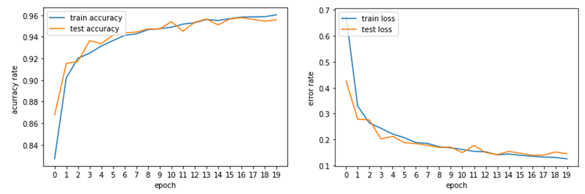

## From Image to Melody: Processing Stages
The user uploads an image of a music sheet either through the app's camera or from the gallery. By tapping on the image, the user selects four points that enclose the relevant row of notes they want to learn.

The selected image undergoes preprocessing before being sent to the model to ensure better performance.

This image provides an overview of the processing stages involved in converting an image into melody.

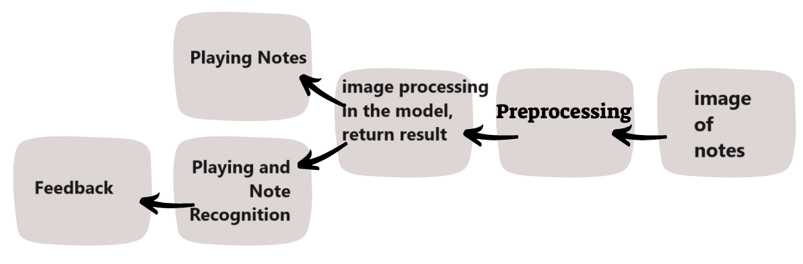

  
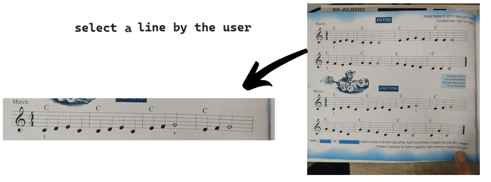

 
 

### diagram of the Processing Stages
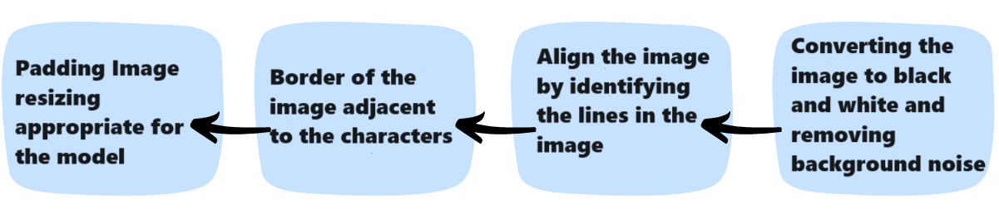

#### Converting the image to Black/White, and removing BG noise
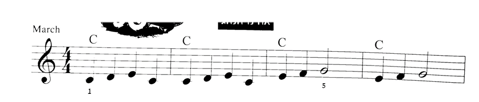

#### Align the image by identifying the lines in the image
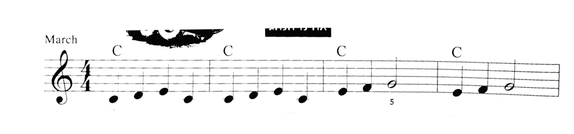

#### Border of the image adjacent to the characters
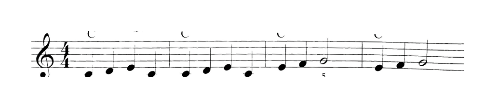

#### Padding Image resizing appropriate for the model
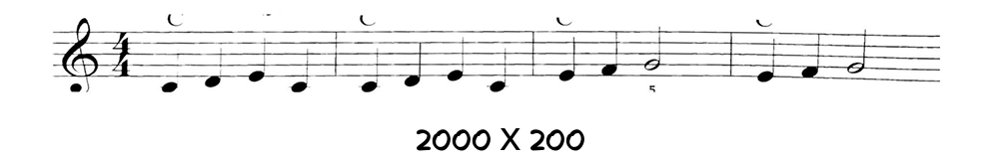

## Image Processing in the Model and Output

The model returns a string containing the key signature, the rhythm of the composition, and notes. Each note includes a pitch and duration, for example:
"clef-G2,keysignature-F#m,timeSignature-4\4,note-C#4_quarter,…,note-D4_half"

Users have the option to hear how the notes sound when played correctly or to play them themselves and receive feedback.

### Reordered Presentation of Notes

* For each note, we manually created a corresponding new image and calculated the note's position relative to the other notes on the staff.
* This allowed us to create a copy of the original image that can be dynamically changed for real-time playing feedback.
* After many hours of work, we managed to create over a thousand images for all possible combinations.
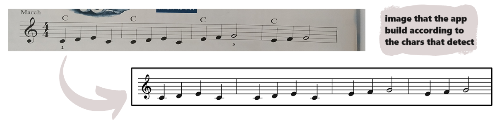

## Playing the Notes

We utilized Tone.js to take high-quality piano samples and play them in real-time without the need for MIDI files. This approach reduces the load on the device and ensures high-quality sound.

Process steps:
* Parsing the string from the model into individual notes.
* Each note includes: name, octave represented by a number , duration , and note representation .
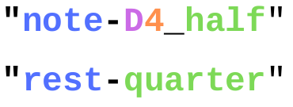
* The notes are played at a standard tempo of 120 BPM.

## The feedback that the user is accept
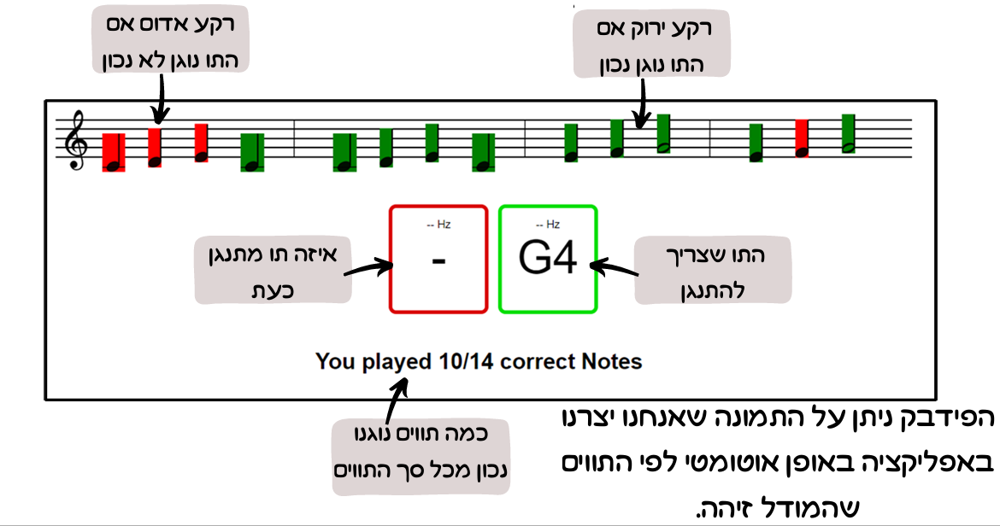

## The Technologies Stack:
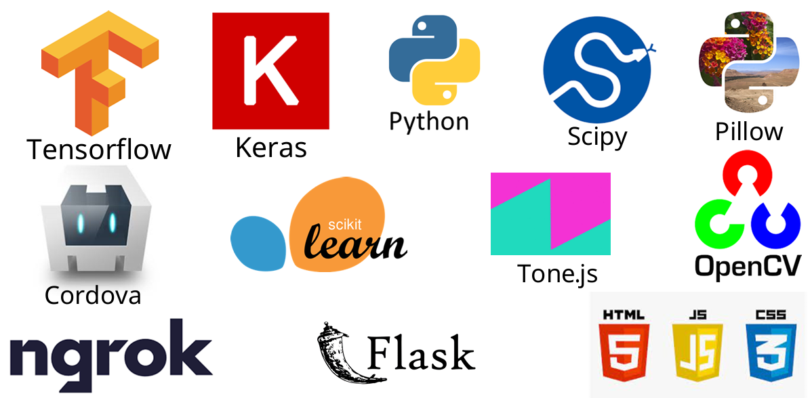
